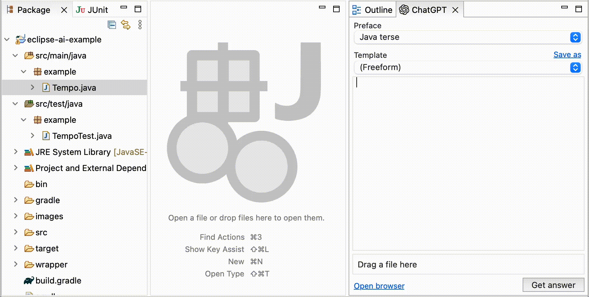

# ChatGPT plugin for Eclipse / [EquoIDE](https://github.com/equodev/equo-ide)

[](https://search.maven.org/artifact/dev.equo.ide/equo-ide-chatgpt)
[](CHANGELOG.md)

This plugin makes it easy to use ChatGPT as a coding assistant with Eclipse. You do not need an OpenAI API key, just a free ChatGPT account. The only way to access GPT-4 without a waitlist is the $20 per month ChatGPT Plus account, and you can use that in this plugin.

You can drag files from the package explorer and drop them right into prompts. For a demo of this plugin in action along with GitHub Copilot-style autocompletion provided by Tabnine, see [eclipse-ai-example](https://github.com/equodev/eclipse-ai-example).



## Installation

This plugin is currently available on [MavenCentral](https://central.sonatype.com/artifact/dev.equo.ide/equo-ide-chatgpt). The EquoIDE [Solstice](https://github.com/equodev/equo-ide/tree/main/solstice) project lets you develop and distribute Eclipse plugins using only maven - no p2 and no OSGi metadata required. If you want to install this plugin in plain Eclipse, we're happy to take a [PR that adds the required boilerplate](https://github.com/equodev/equo-ide-chatgpt/issues/1).

It is included in the EquoIDE plugin [catalog](https://github.com/equodev/equo-ide/blob/main/CATALOG.md#chatgpt), so you can install it like so in Gradle and maven

```gradle
equoIde {    // in maven: <configuration>
  chatGPT()  //             <chatGPT/>
```

## Contributing

PR's are welcome, and will be merged and released in a timely fashion. Run `gradlew equoIde` and you'll have an Eclipse IDE with this project imported. If you make any changes to this plugin, you can close the IDE and run `equoIde` again to see your changes instantly.

## License

This component's licensing is a bit unusual.

In order to bridge the Eclipse IDE and ChatGPT's web interface, we use [Equo Chromium](https://www.equo.dev/chromium), which is available under either a commercial license or GPL. This plugin is therefore licensed under the GPL with explicit permission to combine the work with Eclipse, as per the [FSF's recommendation](https://www.fsf.org/blogs/licensing/using-the-gpl-for-eclipse-plug-ins). 